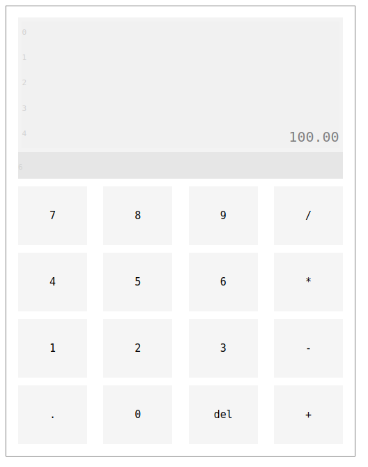

# Distributed Calculator

This is demo of lattice-core, a framework I'm writing that uses the crystal programming language.  What's so special about it?  Anyone can write a calculator.

Well, a few things actually.  First, calculations are done _entirely_ on the server.  The browser is basically a dumb terminal with enough logic to keep the display updated.   That does open up some interesting opportunities for useful functions that could be added, but, as I said, this is a demo.

More importantly, the demo uses WebSockets do do __everything__ related to the page.  There's no AJAX and no polling.  It's really quite cool once you go down the WebSocket rabbit hole.

Oh, and another thing, it's distributed.  In this demo, new calculator instances are created for each url (for exampe, `/calculator1` or `/bobs_calculator`).  These instances stay alive as long as the server continues to run (garbage collection is still a wip for lattice-core).  Anyone who goes to the same url sees the exact same calculator, and entries are updated immediately.  Try *that* without WebSockets!

